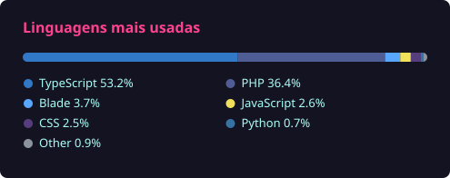

# Olá, eu sou o Breno! 👋

Estudante de Ciência da Computação na UNA, focado em transformar dados em insights e construir sistemas robustos.

### 🚀 Sobre mim
- 🎓 Cursando Bacharelado em Ciência da Computação (Previsão: 2028).
- 🛠️ Atualmente focado em backend com Python/FastAPI, testes em Java e projetos de dados.
- 🌍 Inglês Avançado e entusiasta de hardware e performance.

### 💻 Linguagens e Tecnologias

### 🛠️ Ferramentas e Workspace

### 📊 Estatísticas do GitHub

  

  

### 📫 Como me encontrar
- [LinkedIn](https://www.linkedin.com/in/breno-henrique-barbosa-correia/)
- E-mail: brenoh18102@gmail.com
